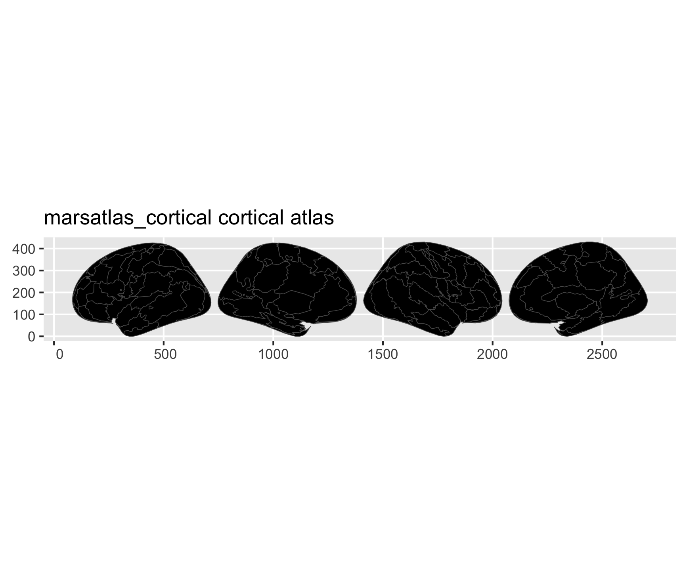

<!-- README.md is generated from README.qmd. Please edit that file -->

# ggsegMars

> **Work in Progress** – This package is under active development and
> has not yet been officially released.

MarsAtlas cortical parcellation for the ggseg ecosystem.

## Installation

We recommend installing the ggseg-atlases through the ggseg
[r-universe](https://ggseg.r-universe.dev/ui#builds):

``` r
options(repos = c(
  ggseg = "https://ggseg.r-universe.dev",
  CRAN = "https://cloud.r-project.org"
))

install.packages("ggsegMars")
```

You can install this package from [GitHub](https://github.com/) with:

``` r
# install.packages("pak")
pak::pak("ggseg/ggsegMars")
```

## Cortical atlas

``` r
library(ggseg)
library(ggsegMars)

plot(marsatlas_cortical())
```



## Subcortical atlas

``` r
plot(marsatlas_subcortical())
```


## Reference

Auzias G, Coulon O, Brovelli A (2016). MarsAtlas: A cortical
parcellation atlas for functional mapping. *Human Brain Mapping*, 37(4),
1573-1592.

## Code of Conduct

Please note that the ggsegMars project is released with a [Contributor
Code of Conduct](CODE_OF_CONDUCT.md). By contributing to this project,
you agree to abide by its terms.
