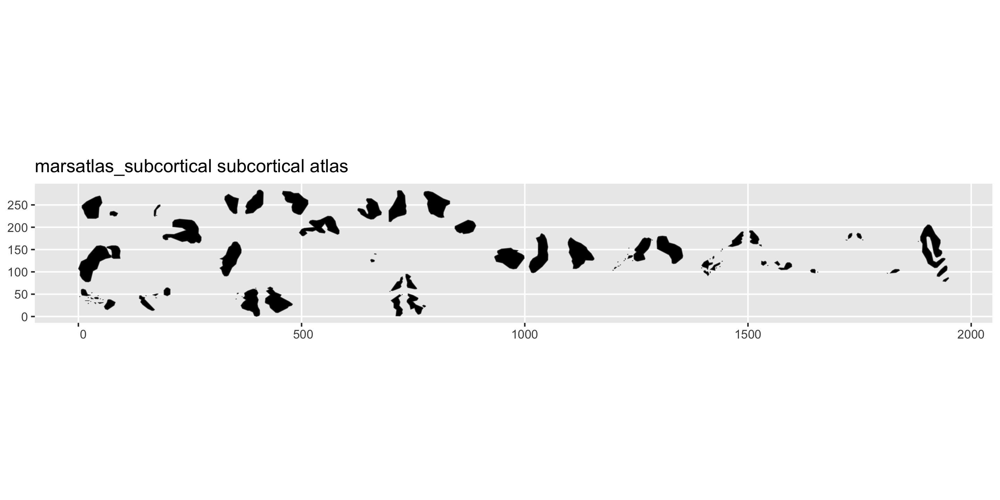

# ggsegMars

MarsAtlas cortical and subcortical parcellation for the ggseg ecosystem.

## Installation

We recommend installing the ggseg-atlases through the ggseg
[r-universe](https://ggseg.r-universe.dev/ui#builds):

``` r
options(repos = c(
  ggseg = "https://ggseg.r-universe.dev",
  CRAN = "https://cloud.r-project.org"
))

install.packages("ggsegMars")
```

You can install this package from [GitHub](https://github.com/) with:

``` r
# install.packages("pak")
pak::pak("ggsegverse/ggsegMars")
```

## Cortical atlas

``` r
library(ggseg)
library(ggsegMars)

plot(marsatlas_cortical())
```


## Subcortical atlas

``` r
plot(marsatlas_subcortical())
```



## Data source

Auzias G, Coulon O, Brovelli A (2016). MarsAtlas: A cortical
parcellation atlas for functional mapping. *Human Brain Mapping*, 37(4),
1573-1592.
